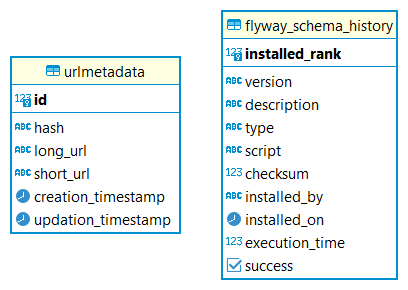

# Miniurl - Miniurl Service for minification of long Url's
A project is a Miniurl project with a set of Rest Api's to minimize the long url's with code or hash

## Table of Contents

* **[Installation](#installation)**
* **[Database model](#database-model)**
* **[Running the application](#running-the-application)**
* **[Environment Variables](#environment-variables)**

## Installation

Use Maven to compile and package

```bash
mvn clean package
```

## Database model


## Running the application

To run it on local environment add the following VM parameters

## Environment Variables
```bash
-Dspring.profiles.active=prod

## Environment Variables
```bash
DB_HOST:                    The DB host
DB_NAME:                    The DB name (default "urlstore")
DB_PORT:                    The DB port (default 5432)
DB_SCHEMA:                  The DB schema 
DB_USERNAME:                The DB username
DB_PASSWORD:                The DB password
```
Locally these environment variables can be set through Run -> Edit Configurations in the IDE
## REST

The Open Api details describing the Rest endpoints can be found at bellow link once the service is deployed:
```bash
http://<hostname>/v3/swagger-ui.html
```
## Open API screen shots


